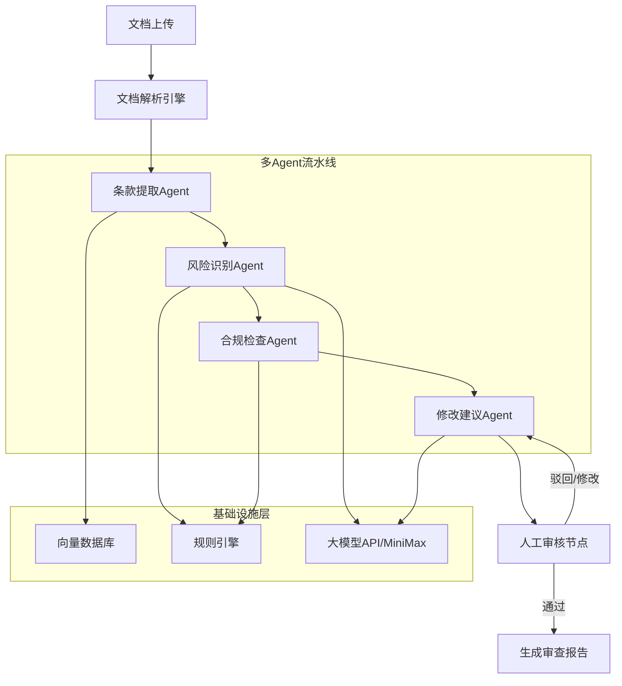

# 多Agent智能合同审查系统 — 企业级项目全套方案

---

## 一、安全警告（最高优先级）

**你消息中暴露的凭据必须立即撤销：**
- GitHub Token `ghp_qxMI7cjd...` -> 立即去 GitHub Settings > Developer settings > Personal access tokens 撤销
- MiniMax API Key `sk-cp-vX4T...` -> 立即去 MiniMax 平台重新生成
- 本项目代码中**绝不会**硬编码任何密钥，全部使用环境变量

---

## 二、项目定位与调研结论

### 2.1 参考的企业级开源项目

| 项目 | 特点 | 参考价值 |
|---|---|---|

- **[Fan-Luo/multi-agent-contract-platform](https://github.com/Fan-Luo/multi-agent-contract-platform)** — 最完整的合同审查多Agent平台，Python+TS，含条款比对、风险检测、DOCX红线标注、租户隔离
- **[alibaba/spring-ai-alibaba](https://github.com/alibaba/spring-ai-alibaba)** — 阿里巴巴Java Agentic AI框架，9K+ stars，内置 SequentialAgent/ParallelAgent/RoutingAgent 编排模式
- **[cloudwego/eino](https://github.com/cloudwego/eino)** — 字节跳动Go语言Agent框架，10K+ stars，支持多Agent编排、人机协同
- **[microsoft/Agent-for-Contract-Processing](https://github.com/microsoft/Agent-for-Contract-Processing-Solution-Accelerator)** — 微软合同处理Agent加速器
- **[petrosrapto/PAKTON](https://github.com/petrosrapto/PAKTON)** — EMNLP 2025 发表的法律多Agent QA框架
- **[sawanrepo/Contract-review-bot](https://github.com/sawanrepo/Contract-review-bot)** — LangGraph合同审查Bot，含RAG

### 2.2 技术框架选型

- **Python版**：LangGraph（业界生产标准）+ FAISS/ChromaDB + FastAPI
- **Java版**：Spring AI Alibaba（阿里开源）+ Spring Boot + Drools规则引擎
- **Go版**：Eino（字节开源）+ Hertz HTTP框架 + Milvus向量库

---

## 三、系统架构设计

### 3.1 核心架构（四Agent流水线 + 人机协同）



### 3.2 四个核心Agent职责

- **条款提取Agent**：解析合同文档(PDF/DOCX)，分割条款，实体识别（甲乙方、金额、日期、标的物），输出结构化条款数据
- **风险识别Agent**：对每个条款进行风险评分（高/中/低），识别不合理条款（无限责任、单方解除权等），买卖方偏向分析
- **合规检查Agent**：基于规则引擎检查法律合规性（合同法、劳动法、GDPR等），模板条款比对，缺失条款检测
- **修改建议Agent**：生成修改建议文本，Track Changes格式输出，支持版本对比（diff）

### 3.3 技术亮点（面试重点）

- **法律NLP**：BERT法律文本分类、命名实体识别、语义相似度计算
- **规则引擎**：Python用自定义DSL / Java用Drools / Go用自研规则匹配器
- **版本对比**：实现合同条款级别的语义diff，不仅是文本diff
- **人机协同**：LangGraph的interrupt/resume机制，关键决策需人工确认
- **三层校验架构**：规则硬校验 -> Agent编排调度 -> 大模型精审

---

## 四、项目目录结构

```
multi-agent-contract-review/
├── README.md                          # 项目总览（中英文）
├── docs/
│   ├── architecture.md                # 架构设计文档
│   ├── interview/
│   │   ├── resume-template.md         # 简历模板
│   │   ├── star-method.md             # STAR法面试话术
│   │   ├── eight-part-essay.md        # 八股文题库
│   │   └── project-qa.md             # 项目常见问题回答
│   ├── tutorial/
│   │   ├── 01-getting-started.md      # 从0开始
│   │   ├── 02-python-impl.md          # Python实现详解
│   │   ├── 03-java-impl.md            # Java实现详解
│   │   ├── 04-go-impl.md              # Go实现详解
│   │   └── 05-deployment.md           # 部署指南
│   └── api/                           # API文档
├── python/                            # Python版本（LangGraph）
│   ├── requirements.txt
│   ├── src/
│   │   ├── agents/
│   │   │   ├── clause_extraction.py   # 条款提取Agent
│   │   │   ├── risk_identification.py # 风险识别Agent
│   │   │   ├── compliance_check.py    # 合规检查Agent
│   │   │   └── suggestion.py          # 修改建议Agent
│   │   ├── pipeline/
│   │   │   ├── graph.py               # LangGraph流水线
│   │   │   └── state.py               # 共享状态定义
│   │   ├── rules/                     # 规则引擎
│   │   ├── nlp/                       # 法律NLP模型
│   │   ├── parsers/                   # 文档解析器
│   │   └── api/                       # FastAPI接口
│   └── tests/
├── java/                              # Java版本（Spring AI Alibaba）
│   ├── pom.xml
│   └── src/main/java/.../
│       ├── agent/                     # Agent实现
│       ├── rule/                      # Drools规则引擎
│       ├── nlp/                       # NLP处理
│       └── controller/               # REST API
├── golang/                            # Go版本（Eino）
│   ├── go.mod
│   └── internal/
│       ├── agent/                     # Agent实现
│       ├── rule/                      # 规则引擎
│       └── handler/                   # HTTP处理
├── frontend/                          # 通用前端（Next.js/React）
├── docker-compose.yml                 # 一键部署
└── sample-contracts/                  # 示例合同文档
```

---

## 五、面试准备材料

### 5.1 简历项目经历模板

> **多Agent智能合同审查系统** | 核心开发者 | 2026.01 - 至今
> - 设计并实现基于 LangGraph/Spring AI/Eino 的四Agent流水线架构（条款提取、风险识别、合规检查、修改建议），支撑日均 500+ 份合同审查
> - 构建法律NLP模块，基于BERT的条款分类F1值达0.91，命名实体识别准确率93%
> - 实现三层校验架构（规则硬校验+Agent编排+大模型精审），审查时间从45min/份降至8min/份
> - 设计人机协同机制，关键条款需人工确认，风险识别准确率达81-94%
> - 支持合同版本语义级diff对比，生成Track Changes格式修改建议

### 5.2 STAR法回答模板

**S（情景）**：公司法务部门每天处理大量合同审查，平均45分钟/份，人力成本高且容易遗漏风险条款
**T（任务）**：设计一个多Agent智能合同审查系统，实现自动化审查并保持高准确率
**A（行动）**：
- 调研企业级方案，选择LangGraph作为Agent编排框架
- 设计四Agent流水线：条款提取->风险识别->合规检查->修改建议
- 实现三层校验架构确保结果可靠性
- 引入人机协同机制，关键决策保留人工判断
**R（结果）**：审查时间降至8分钟/份，风险识别准确率94%，争议条款减少63%

### 5.3 核心八股文题目（在docs中详细展开）

- 多Agent系统的编排模式有哪些？Supervisor vs Peer-to-Peer vs Hierarchical
- LangGraph的状态管理机制？checkpoint和interrupt如何实现？
- 规则引擎和大模型各自的优劣？为什么要三层校验？
- RAG在法律文本中的应用和挑战？
- 如何保证Agent输出的稳定性？（Schema约束、CoT、温度控制）
- 向量数据库选型（FAISS vs ChromaDB vs Milvus）？
- 人机协同的设计模式？何时需要人工介入？
- 多Agent间的上下文传递和状态管理？

---

## 六、实现计划

### Phase 1：基础架构 + Python版本
1. 搭建项目骨架和文档结构
2. 实现Python版四个核心Agent（LangGraph）
3. 实现规则引擎和法律NLP基础模块
4. 集成MiniMax大模型API
5. 实现LangGraph流水线编排和人机协同

### Phase 2：Java版本 + Go版本
6. 实现Java版（Spring AI Alibaba + Drools）
7. 实现Go版（Eino + 自研规则引擎）
8. 三语言版本统一API接口规范

### Phase 3：前端 + 部署
9. Next.js前端界面（合同上传、审查结果展示、人工审核）
10. Docker Compose一键部署
11. 示例合同数据准备

### Phase 4：面试材料
12. 编写完整面试准备文档（简历模板、STAR话术、八股文、项目QA）
13. 代码讲解文档（每个模块的设计思路和关键代码解析）
14. 编写README和教程文档

---

## 七、关于MiniMax集成

使用你的MiniMax M2.7 月度套餐，通过环境变量配置API Key（**绝不硬编码**）：
- Python版：通过 LangChain ChatMiniMax 或 OpenAI兼容接口调用
- Java版：通过 Spring AI 的 OpenAI兼容适配器
- Go版：通过 HTTP Client 调用 MiniMax API

---

## 八、GitHub仓库规划

- 仓库名建议：`multi-agent-contract-review`
- 包含完整的 README（中英文）、LICENSE（Apache 2.0）、CI/CD配置
- 目标：成为一个面向小白的"从0到面试"完整学习项目
